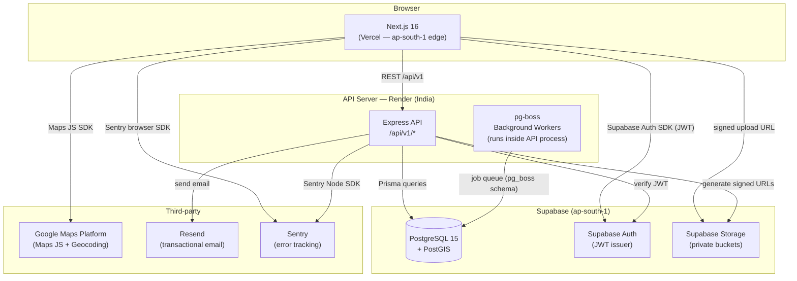

# Architecture — Smart Parking

> Optimised for: solo / small team · low ops burden · easy debugging  
> Hosting: Vercel (frontend) + Render (API) + Supabase (DB / Auth / Storage)  
> Stage: Phase 1 (no payments, no IoT)

---

## 1. Component Diagram



---

## 2. Stack by Layer

### Frontend

| | |
|---|---|
| **Chosen** | **Next.js 16 (App Router)** on Vercel |
| **Alternative** | Vite + React SPA on Vercel |
| **Why rejected** | Next.js gives SSR for SEO on listing pages and server components for reduced JS bundle. A SPA would require manual routing, no RSC, and worse first-load on mobile. |

### Backend

| | |
|---|---|
| **Chosen** | **Express 5 + TypeScript** on Render (Web Service) |
| **Alternative** | Next.js API Routes (co-locate with frontend) |
| **Why rejected** | Merging the API into Next.js couples deploy cycles, makes the API harder to test in isolation, and limits background job control. Render gives a persistent process model which pg-boss needs. |

### Database

| | |
|---|---|
| **Chosen** | **Supabase Postgres 15 + PostGIS** (ap-south-1) |
| **Alternative** | Neon (serverless Postgres) |
| **Why rejected** | Neon adds cold-start latency on Render. Supabase bundles Auth, Storage, and PostGIS in one project, eliminating three separate services. |

### Auth

| | |
|---|---|
| **Chosen** | **Supabase Auth** (JWT, Google OAuth, email/password) with **Postgres RLS** enforcing tenant isolation |
| **Alternative** | NextAuth.js (session-based, database adapter) |
| **Why rejected** | NextAuth lives in the Next.js layer, requiring the API to re-verify sessions via a database round-trip. Supabase Auth issues signed JWTs that any service can verify without a DB call. |

### ORM

| | |
|---|---|
| **Chosen** | **Prisma** (schema-first, typed client, migrate CLI) |
| **Alternative** | Drizzle ORM |
| **Why rejected** | Drizzle has less mature migration tooling. Prisma's `prisma migrate dev` + Studio reduces schema debugging time significantly for a small team. |

### File Storage

| | |
|---|---|
| **Chosen** | **Supabase Storage** (private buckets, signed URLs, scoped by `user_id`) |
| **Alternative** | Cloudflare R2 |
| **Why rejected** | R2 adds another vendor, IAM keys to manage, and custom signed-URL logic. Supabase Storage integrates with RLS and our existing Supabase project. |

### Geospatial

| | |
|---|---|
| **Chosen** | **PostGIS** `ST_DWithin` for radius search (pre-installed on Supabase) |
| **Alternative** | Haversine formula in SQL (no extension) |
| **Why rejected** | PostGIS gives spatial indexes (`GIST`) that keep radius queries fast as listing count grows. Haversine requires a full table scan beyond trivial scale. |

### Background Jobs

| | |
|---|---|
| **Chosen** | **pg-boss** (Postgres-backed job queue, runs in the API process) |
| **Alternative** | BullMQ + Redis |
| **Why rejected** | Redis is a new service to provision, monitor, and pay for. pg-boss uses our existing Postgres connection — no extra infra, transactional enqueue, and easy introspection via SQL. |

### Maps / Geocoding

| | |
|---|---|
| **Chosen** | **Google Maps Platform** (Maps JS API + Geocoding API + Places Autocomplete) |
| **Alternative** | Mapbox |
| **Why rejected** | Mapbox has fewer geocoding data points for India. Google Maps has superior Indian address coverage and our frontend already has `@vis.gl/react-google-maps` installed. |

### Email

| | |
|---|---|
| **Chosen** | **Resend** (3,000 free emails/month, React Email templates) |
| **Alternative** | SendGrid |
| **Why rejected** | SendGrid's free tier is 100/day and requires more complex setup. Resend's API is simpler and the free tier covers all of Phase 1. |

### Error Tracking

| | |
|---|---|
| **Chosen** | **Sentry** (free tier: 5,000 errors/month, source map upload) |
| **Alternative** | Datadog |
| **Why rejected** | Datadog is priced for teams with budgets. Sentry's free tier is sufficient for Phase 1 with readable stack traces, user context, and release tracking. |

---

## 3. Folder Structure

```
smart-parking/
├── apps/
│   ├── api/                        # Express API (Render)
│   │   ├── src/
│   │   │   ├── config/             # env validation (zod), constants
│   │   │   ├── middleware/         # auth, error-handler, request-id, logger
│   │   │   ├── modules/            # feature modules (routes + service per feature)
│   │   │   │   ├── auth/
│   │   │   │   ├── users/
│   │   │   │   ├── vehicles/
│   │   │   │   ├── listings/
│   │   │   │   ├── search/
│   │   │   │   ├── bookings/
│   │   │   │   └── admin/
│   │   │   ├── services/           # cross-cutting domain services
│   │   │   │   ├── availability.service.ts
│   │   │   │   ├── booking.service.ts
│   │   │   │   └── notification.service.ts
│   │   │   ├── jobs/               # pg-boss job definitions + handlers
│   │   │   ├── lib/                # prisma client, supabase admin client, email
│   │   │   ├── types/              # app-level TS types
│   │   │   ├── app.ts              # Express app factory (no side-effects)
│   │   │   └── server.ts           # process entry: listen, start pg-boss
│   │   ├── prisma/
│   │   │   ├── schema.prisma
│   │   │   ├── migrations/
│   │   │   └── seed.ts
│   │   ├── tests/
│   │   │   ├── unit/               # pure business-logic tests
│   │   │   └── integration/        # real DB, real auth, full request cycle
│   │   ├── .env.example
│   │   ├── package.json
│   │   └── tsconfig.json
│   │
│   └── web/                        # Next.js app (Vercel)
│       ├── app/                    # App Router pages & layouts
│       ├── components/             # React components
│       ├── lib/                    # supabase browser client, api fetcher
│       ├── hooks/                  # React hooks
│       ├── store/                  # Zustand stores
│       ├── .env.example
│       ├── package.json
│       └── tsconfig.json
│
├── packages/
│   └── shared/                     # types + schemas shared by both apps
│       ├── src/
│       │   ├── schemas/            # Zod schemas (request/response validation)
│       │   ├── types/              # TypeScript types derived from schemas
│       │   └── constants/          # enums: BookingStatus, VehicleType, etc.
│       ├── package.json
│       └── tsconfig.json
│
├── docs/
│   ├── architecture.md             # this file
│   ├── decisions/                  # Architecture Decision Records
│   ├── permissions.md              # role × action matrix
│   ├── testing.md                  # test strategy
│   ├── hosting.md
│   └── runbooks/
│       ├── deploy.md
│       └── backups.md
│
├── SPEC.md
├── ARCHITECTURE.md                 # high-level summary (keep in sync)
├── TASKS.md
├── AGENTS.md
├── README.md
└── package.json                    # workspace root (npm workspaces)
```

---

## 4. Background Jobs

**Runtime**: pg-boss runs as a singleton inside the Express API process on Render. It uses the same Supabase Postgres database via a `pgboss` schema (auto-created on first start).

**Why in-process**: At Phase 1 scale, a separate worker adds Render service cost and deployment complexity. A single Render Web Service handles HTTP + jobs.

| Job name | Trigger | What it does |
|---|---|---|
| `booking.expire-pending` | Cron every 5 min | Finds `PENDING` bookings past expiry, sets status `EXPIRED`, releases slot |
| `notification.send` | Enqueued on state change | Writes a `Notification` row; Phase 2 dispatches email/SMS from here |

**Upgrade path**: When scaling to multiple instances, extract jobs to a dedicated Render Background Worker. No business logic changes needed.

---

## 5. Third-party Services and Costs

| Service | Plan at launch | Monthly cost | Cost at 10× users | Notes |
|---|---|---|---|---|
| **Vercel** | Hobby | $0 | $20/mo (Pro) | Pro needed for custom domain |
| **Render** | Starter | $7/mo | $25/mo (Standard) | Scale up when p95 latency degrades |
| **Supabase** | Free | $0 | $25/mo (Pro) | Pro needed for daily backups + >500 MB DB |
| **Google Maps** | Pay-as-you-go | ~$0–5/mo | ~$20–50/mo | Maps JS: $7/1k loads; Geocoding: $5/1k |
| **Resend** | Free | $0 | $0–20/mo | Free: 3k emails/mo |
| **Sentry** | Free | $0 | $0–26/mo | Free: 5k errors; Team: $26/mo |
| **Total** | | **~$7–12/mo** | **~$90–146/mo** | |

---

## 6. Three Riskiest Decisions

### Risk 1 — Supabase Auth + RLS as the sole authorization layer

**What could go wrong**: RLS policies are SQL — bugs are silent (missing policy returns empty rows, not errors). A Prisma `$queryRaw` bypasses RLS entirely.

**Mitigation**: Every new table gets an RLS policy in the same migration. API integration tests assert cross-tenant 404s. All raw SQL must include explicit `user_id`/`owner_id` filters.

### Risk 2 — pg-boss in the same process as the HTTP server

**What could go wrong**: A runaway job (infinite loop, unhandled rejection) can starve the Node.js event loop and degrade HTTP response times.

**Mitigation**: Set `teamConcurrency` to cap concurrent workers. Wrap every job handler in try/catch with Sentry capture. Include pg-boss health in `/api/health`. Extract to a separate process at first sign of contention.

### Risk 3 — Google Maps API key exposed in the browser

**What could go wrong**: The Maps JS key must be in the browser bundle. Without HTTP referrer restrictions, anyone can steal it and incur billing charges.

**Mitigation**: Restrict the key in Google Cloud Console to exact Vercel domain(s). Set a daily quota cap. Use a separate server-side-only key for Geocoding calls from Express. Never share both keys in one variable.
